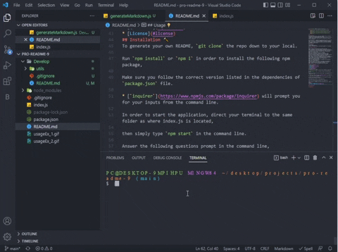

<h1 align="center">README.md Generator Using Node.js 📠</h1>

    
    
    

## Description 💾
Every good projects need a professional README in order to transfer information and spread knowledge about the app.
A README explains precisely what the app is about, how to use, how to install,  how to report issues and how to contribute to the app for further development.

This application is a command-line based application that is run with Node.js. When run, it generates a README.md file based on the user's output. This enables us to quickly generate a professional README.md file instead of going through the trouble to write every code within the README for every project.
## User Story ✉️
~~~
AS A developer
I WANT a README generator
SO THAT I can quickly create a professional README for a new project
~~~
## Acceptance Criteria 📩
~~~
GIVEN a command-line application that accepts user input
WHEN I am prompted for information about my application repository
THEN a high-quality, professional README.md is generated with the title of my project and sections entitled Description, Table of Contents, Installation, Usage, License, Contributing, Tests, and Questions
WHEN I enter my project title
THEN this is displayed as the title of the README
WHEN I enter a description, installation instructions, usage information, contribution guidelines, and test instructions
THEN this information is added to the sections of the README entitled Description, Installation, Usage, Contributing, and Tests
WHEN I choose a license for my application from a list of options
THEN a badge for that license is added near the top of the README and a notice is added to the section of the README entitled License that explains which license the application is covered under
WHEN I enter my GitHub username
THEN this is added to the section of the README entitled Questions, with a link to my GitHub profile
WHEN I enter my email address
THEN this is added to the section of the README entitled Questions, with instructions on how to reach me with additional questions
WHEN I click on the links in the Table of Contents
THEN I am taken to the corresponding section of the README
~~~
## Table of Contents 🔍
* [Installation](#installation)
* [Usage](#usage)
* [Contributing](#contributing)
* [Tests](#tests)
* [Questions](#questions)
* [License](#license)
## Installation 🔨
To generate your own README, `git clone` the repo down to your local.

Run `npm install` or `npm i` in order to install the following npm package,

Make sure you follow the correct version listed in the dependencies of `package.json` file.

* [`inquirer`](https://www.npmjs.com/package/inquirer) will prompt you for your inputs from the command line.

In order to start the application, direct your terminal to the same folder as where index.js is located,

then simply type `npm start` in the command line.

Answer the following questions prompt in the command line,

After answering, a README.md file will be generated in the `./Develop` folder.
## Usage 💡

## Contributing ⌨️

## Questions ❓

